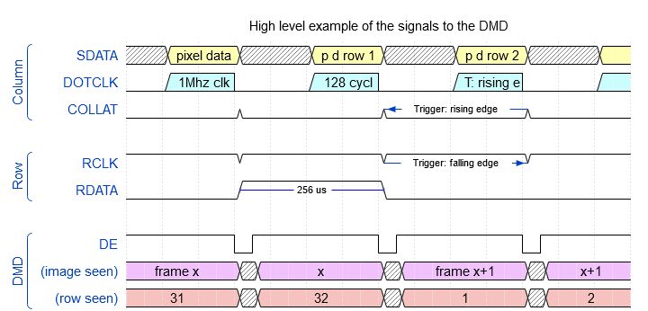
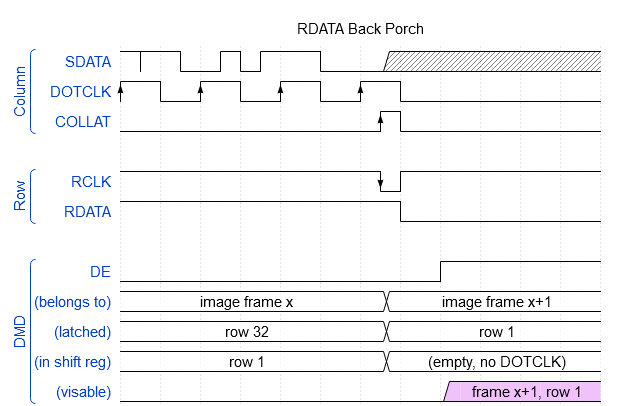

# The DMD signal

For a lot more details, see the [techblog](../tech/).

## Wiring

See the techblog for details.

## Chips

See the techblog for details.

## Signal

The DMD controller sends image frames over 6 data lines to the DMD display. It does so per row of pixels (128 per row, 32 rows total). It sends about 122 image frames per second.

### High level overview

* `SDATA` has the pixel data, high is `on` low is `off`. This pixel data is only shifted into the display if there's a clock signal. So where there is not, it is ignored and often contains random signals (the grey).
* `DOTCLK` the 1 Mhz clock for `SDATA`. Its duty cycle is 50% and once it starts it does 128 pulses. Data is read from `SDATA` on the rising edge (low to high).
* `COLLAT` cycles high for a short time after the last `DOTCLK` puse has risen. This latches the received data from the registers to the output pins if `DE` is also high.
* `RCLK` is always high, and pulses low for a short duration after a row of 128 pixels is transfered. It triggers on the faling edge, loading `RDATA` in the shift register.
* `RDATA` is high for the first row of image frame data. It gets loaded in a shift register, enabling one and only one row of the display each `RCLK`.
* `DE` (display enable) is high so the DMD is fed with data. It goes low for a short duration when new data is latched via `COLLAT`. In the image above it is indicated too long, but funtions as a high level overview.

### RDATA back porch

This is the most interesting part of the signal. It is the moment the DMD switches off `DE` is low; a new row is shifted in via `RDATA` and it has both valid `SDATA` and `DOTCLK` signals.

Lets zoom in.

Things to notice:

* `SDATA` is fast and has some artifacts (see the techblog for details). On the `DOTCLK` rising edge the signal is valid though.
  * Half a pulse after the last rising edge of `DOTCLK` - the 128th on a row - it can go freestyle. It does not float.
  * If `DOTCLK` is low, it might or might not go freestyle. It does not float.
  * The areas where `SDATA` cannot be used are grey in both diagrams.
  * Between every 7th and 8th `DOTCLK` pulse `SDATA` might have an anomaly pop up. See below.
* A rising edge on `COLLAT` it latches the 128 pixel data that was shifted in to the output pins.
* On the falling edge of `RCLK` it loads `RDATA` into the row shift register. `RDATA` is only high on the first row. This way the one shifted bit "walks down the path" from row 1 to row 32 on reach falling edge of `RCLK`.

### Timings

See the techblog for details.
