# Technical documentation

In some sort of blog-style, as I'm discovering how this works as I go. As this is old hardware I found it important to document my journey.

## Gear

Stuff I own.

### Oscilloscope

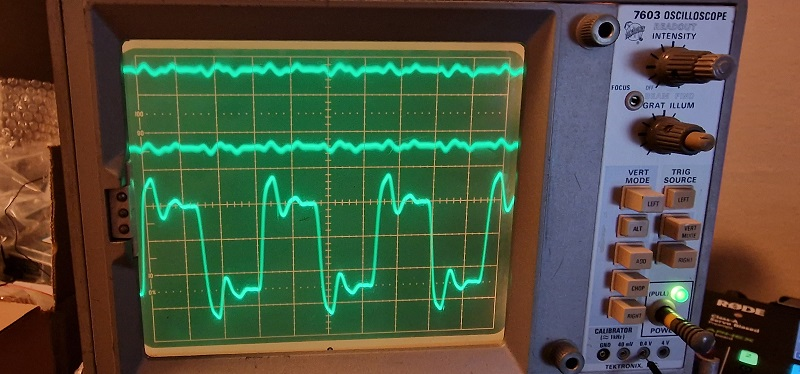

Started out with my trusted 100Mhz non-storage crt large screen [Tektronix 7603](https://w140.com/tekwiki/wiki/7603) with my horizontal plugin [7B53A](https://w140.com/tekwiki/wiki/7B53A) with two vertical plugins: [7A16A](https://w140.com/tekwiki/wiki/7A16A) and [7A15A](https://w140.com/tekwiki/wiki/7A15A).

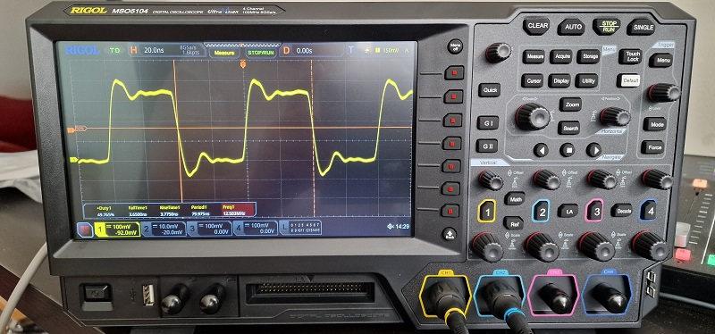

That got replaced by an 100Mhz 8GSa/s 4Ch [Rigol MSO5104](https://www.rigol.eu/products/oscillosopes/MSO5000%20series.html) with nearly all options (except the Mhz increase) which I got via a very good deal at eleshop.nl.

### Logic Analyser

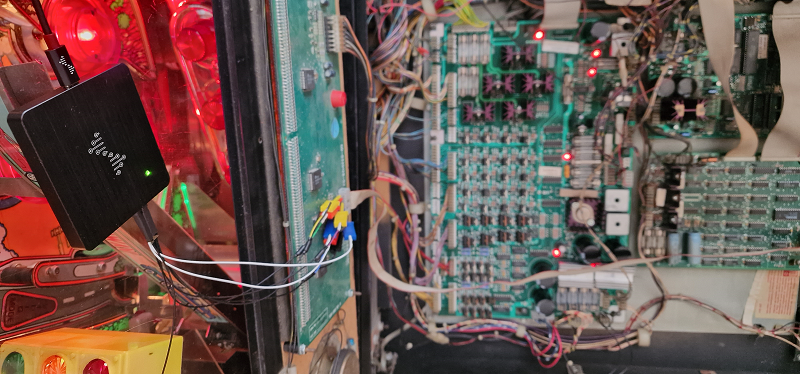

My logic analyser is a DreamSourceLab [DSLogic Plus](https://www.dreamsourcelab.com/product/), 16 channels up to 400 Mhz.

### Pinball machine with a DMD

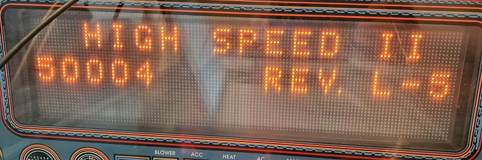

I own a few pinball machines. The one I used for the screenshots, manuals and experimentation is a [The Getaway: High Speed II](https://pinside.com/pinball/machine/getaway-high-speed-ii). A DMD is a plasma display of 128 by 64 pixels.

## Display Test

In the System Menu of the pinball machine there is a Test menu. Option 11 in the Test menu is the T.11 Display Test. It cycles different patterns and tests the DMD. Most of my LA/ scope screenshots are made with one vertical line being displayed.

## Diagrams

Many pinball machines were made and documented so that field engineers could service them. Search for the [WPC Schematic Manual](https://www.ipdb.org/machine.cgi?id=1000) to find the relative diagrams.

### Display

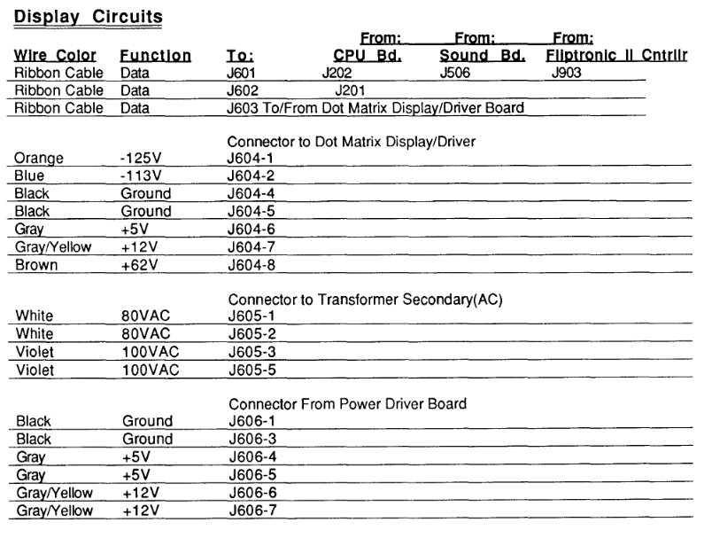

As you can see from the extract from the [Manual](https://www.ipdb.org/machine.cgi?id=1000) a DMD works with dangerous - and weird - voltages. That is because the DMD is build in an eara where LEDs were less prevalent. A DMD works with high voltages due to the plasma per pixel it needs to drive.

Do not lick any of the connectors!

### Ribbon Cable Data J603

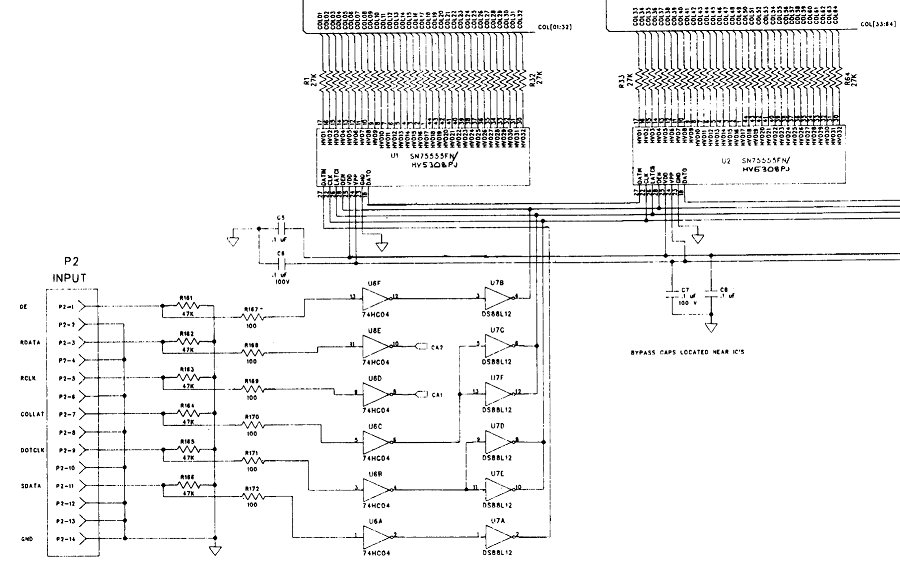

This is a part of the diagram showing the signal lines coming in via connector `J603` (`P2` in the diagram above). It is a relative small ribbon cable of 14 wires. Six wires transfer data, the rest is ground. The pinlayout is as follows (plus my interpretation of the abbreviation):

1. Pin 1: `DE` (Display Enable)
1. GND
1. `RDATA` (Row Data)
1. GND
1. `RCLK` (Row Clock)
1. GND
1. `COLLAT` (Column Latch)
1. GND
1. `DOTCLK` (Dot Clock - Column Clock)
1. GND
1. `SDATA` (Serial Data - Column Data)
1. GND
1. GND
1. Pin 14: GND

### Wirering and components

There are three main actors. The display, the row driver and the column drivers.

#### Display GP-032X128-01

The display, labeled as Display GP-032X128-01. In the way it is driven, it displays one row of 128 pixels (those are either on or off).

#### Row: ..8fn

The one row IC [sn75558fn](https://www.alldatasheet.com/datasheet-pdf/pdf/144922/TI/SN75558FN.html) drivintg the 32 rows, descibed in the data sheet as:

>These devices are monolithic BIDFETt integrated circuits designed to drive the row electrodes of an electroluminescent display. All inputs are CMOS-compatible, and all outputs are high-voltage open-collector npn transistors.
>
>The devices consist of a 32-bit shift register, 32 AND gates, and 32 output OR gates. Typically, a composite row drive signal is externally generated by a high-voltage switching circuit and applied to SUBSTRATE COMMON. Serial data is entered into the shift register on the high-to-low transition of the clock input. A high ENABLE allows those outputs with a high in their associated register to be turned on causing the corresponding row to be connected to the composite row drive signal. When STROBE is low, all output transistors are tumed on.
>
>The serial data output (SERIAL OUT) from the shift register can be used to cascade additional devices. This output is not affected by the ENABLE or STROBE inputs.

Some things to notice:

* Only two signals drive the row. Both pass through one op-amp and then through an isolator/ optocoupler [hcpl-2231](https://www.alldatasheet.com/datasheet-pdf/pdf/64623/HP/HCPL-2231.html).
* CLK is connected to `RCLK` (Row Clock) via CA1.
* DATAIn is connected to `RDATA` (Row Data) via CA2.
* Substrate Common is fixed to VSN -120V Ground.
* Enable and Strobe is fixed to VRW -108V VCC.

##### Row reversal

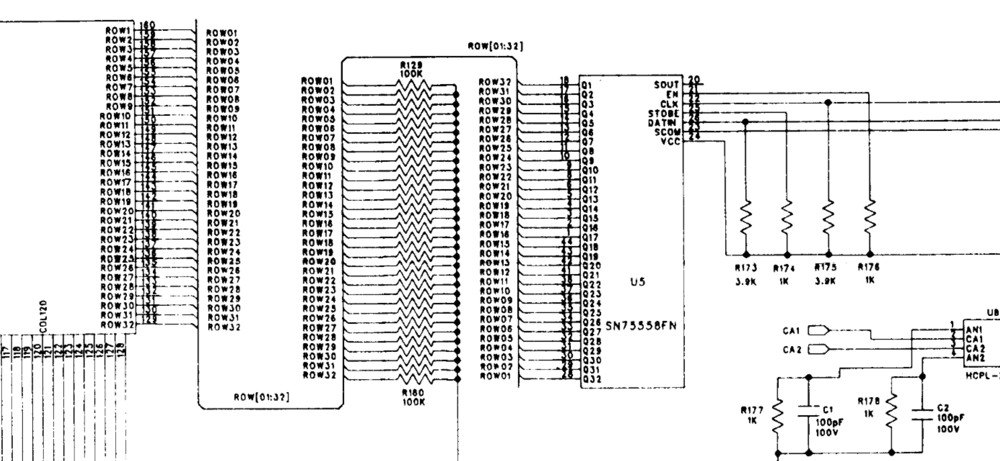

As you can see in the above diagram, the Q1 is connected to ROW32, Q2 to ROW31, ..., Q32 to ROW1. Likely this means that the image data is sent "upside down" to the DMD.

#### Column: ..5fn

The four [sn75555fn](https://www.alldatasheet.com/datasheet-pdf/pdf/144920/TI/SN75555FN.html) cascade chained ICs driving the 128 colums. Described as:

>The SN65555, SN75555, SN65556, and SN75556 are monolithic BIDFET integrated circuits designed to drive the column electrodes of an electroluminescent display. The SN65556 and SN75556 output sequence is reversed from the SN65555 and SN75555 for ease in printed-circuit- board layout.
>  
>The devices consist of a 32-bit shift register, 32 latches, and 32 output AND gates. Serial data is entered into the shift register on the low-to-high transition of CLOCK. When high, LATCH ENABLE transfers the shift register contents to the outputs of the 32 latches. When OUTPUT ENABLE is high, all Q outputs are enabled. Data must be loaded into the latches and OUTPUT ENABLE must be high before supply voltage VCC2 is ramped up.
>
>Serial data output from the shift register can be used to cascade shift registers. This output is not affected by LATCH ENABLE or OUTPUT ENABLE.

Below are two chained sn75555fn ICs. Some things to notice:

* The left DATAOut is connected to the right DATAIn. All four are chained like that, passing the serial data along.
  * The left IC's DATAIn is connected to `SDATA` (Serial Data).
* The CLK (Clock) line is shared by all four ICs and connected to `DOTCLK`.
* The LATCH line is shared by all four ICs and is connected to `COLLAT`.
* The OEN (Output Enable) line is shared by all four ICs and is connected to `DE` (Display Enable).
* Both `DE` and `SDATA` go through 2 serially placed op-amps.
* Both `COLLAT` and `DOTCLK` go through 1 op-amp and then 2 parallel op-amps. Perhaps for more drive omphf?

## Signals

As a reminder, via `J603` / `P2` we receive 6 signal lines:

* Pin 1: `DE` (Display Enable)
* Pin 3: `RDATA` (Row Data)
* Pin 5: `RCLK` (Row Clock)
* Pin 7: `COLLAT` (Column Latch)
* Pin 9: `DOTCLK` (Dot Clock - Column Clock)
* Pin 11: `SDATA` (Serial Data - Column Data)

### Rows (..8fn)

Rows are driven by two signals: `RDATA` (c.f. ..8fn DATAIn) and `RCLK` (c.f. ..8fn CLK). Isolated in the LA:

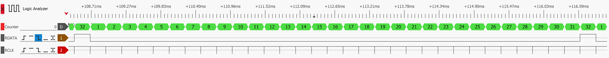

In green (measured/ counter) are the Rows. We see one "image frame" in length. Via the T.11 Display Test the row numbers are confirmed, albeit in reverse order (see Row reversal - above). So 1=31, 2=30, etc.

Below is the function table of the row IC, on the falling edge of the `RCLK` the data is loaded. This happens once per "image frame", c.f. the signal on `RDATA`. Since `RDATA` remains low for all other rows, this "bit" is shifted from row to row per falling edge `RCLK`.

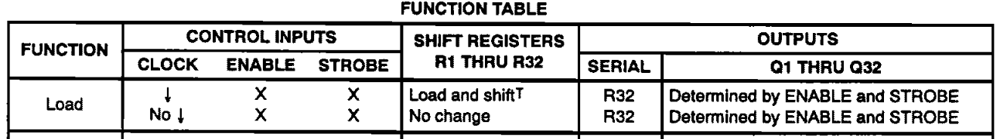

N.B. I've noticed cases where the remaining "frame image" Rows are skipped if empty (that is no `SDATA` present on the Row, and thus skipped). See Pico thoughts below.

### Columns (..5fn)

Columns are influence by: `DE`, drives all four Output Enables; `COLLAT`, drives all four Latches; `DOTCLK`, drives all four Clocks; `SDATA`, drives the first DATAIn - due to the cascading, this continues to the other three ICs.

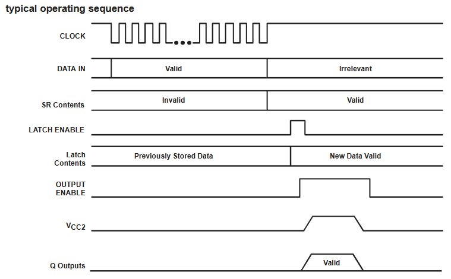

* `DOTCLK` -> Clock
* `SDATA` -> Data In
* `COLLAT` -> Latch Enable
* `DE` -> Output Enable

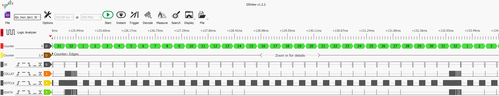

Things to notice:

* `DE` (Output Enable here) goes down for 17us in the last part of where serial data is still pushed. At the end of that width `COLLAT` (Latch Enable) goed up briefly. This presents the new data (128 bits worth) on the outputs to the Display after the Latch Enable.
* `DOTCLK` provides the (fast - 1 MHz!) clock signal when needed. It tends to always count up to 128.

#### On the Oscilloscope

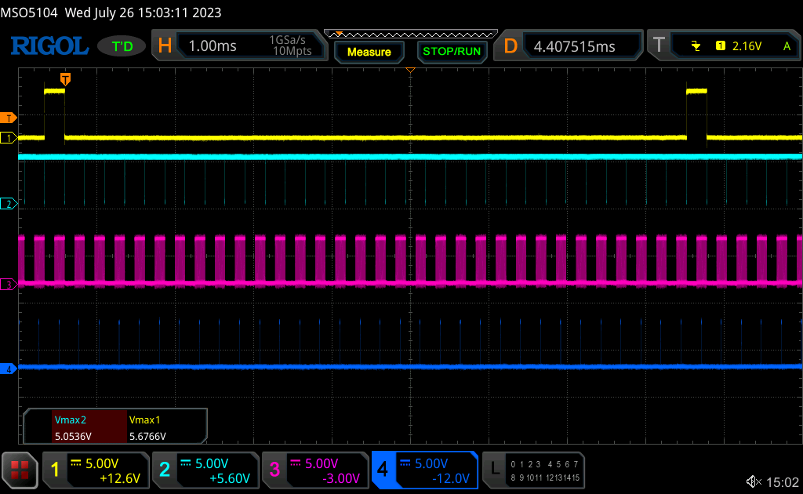

Above, several `RDATA` image frames. Ch1: `RDATA`, Ch2: `RCLK`, Ch3: `DOTCLK`, Ch4: `SDATA`.

Above, zoomed into one image frame with one vertical line (ch4).

### Examples

#### One vertical line

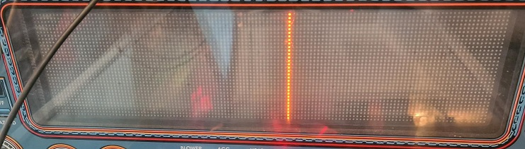

Lets start with the vertical line and some general insights.

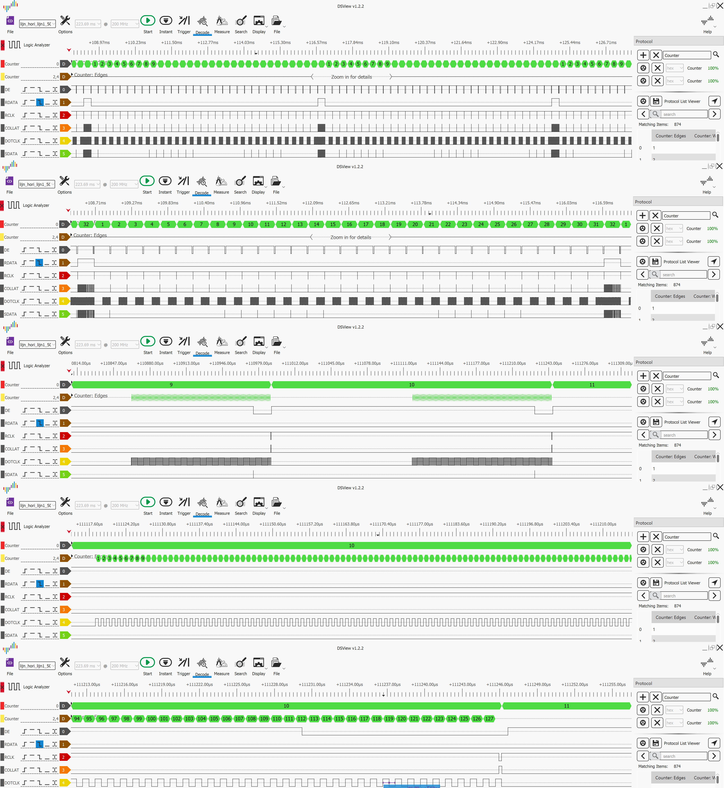

As there is no apparant way to orginize this yet, I'll summerize the findings below in no particular order.

* My LA probed at 200MHz, some articats show like in the `DE` near a `RDATA` signal. Same for `SDATA`, seems too short (5ns). It also misses some `SDATA` signals which is not possible with a vertical line.
* Notice the `DOTCLK` going bananas at Row32 (=row1). Same goes for `COLLAT`. My LA or a junk signal? How is it ignored by the DMD?
* My LA numbers the rows with an idle period _before_ `DOTCLK` 128 clock pulses. The Row should likely be counted as the `DOTCLK` starts and then the idle period _behind_ it. That makes sence with the `DE` disabling the Display.

#### One horizontal line

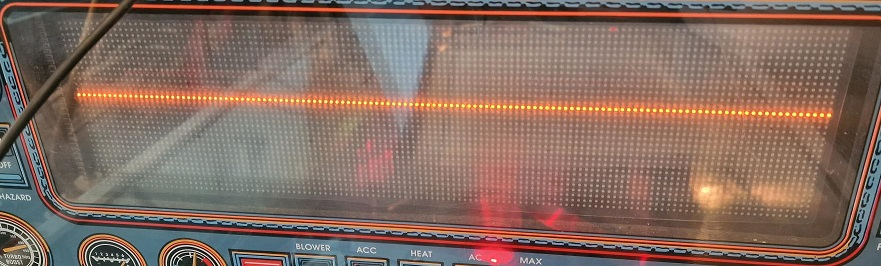

## Pico

### Isolation

The Pico works with 3.3v inputs. It has an 5v out line, but connecting any 5v to a gpio or other pin will potentially destroy the Pico.

I have a few 4 channel isolator/ optocouplers. 

### Thoughts

* Use `RDATA` to identify an image frame.
* Use `RCLK` to identify Rows. Not `COLLAT` as it goes bananas.
* Use `DOTCLK` as a clock signal, albeit it going bananas as well in row 32 (or LA error?).
* Use `SDATA` to get the column pixels.
* It was observed that Rows that are empty at the end of an image frame get ignored. That is, `RDATA` pulses and/or `RCLK` advances without `DOTCLK`/`SDATA` present. Needs more investigation.
